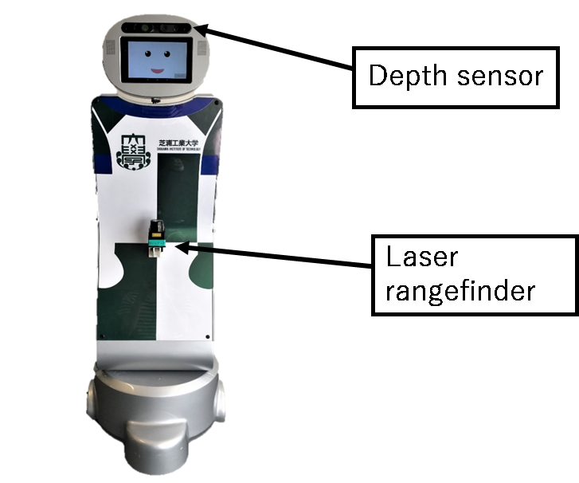
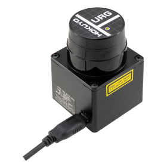
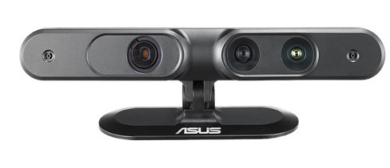
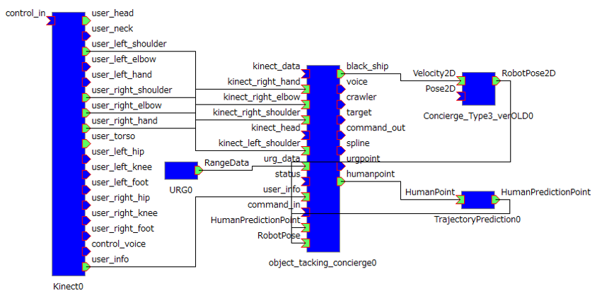

<h3>RTミドルウェアコンテスト</h3>
<h1>「追従中の人の軌跡を予測するRTC」ユーザーマニュアル</h1>

芝浦工業大学 知能機械システム研究室 加藤宏一朗

**目次**
- [1. 追従中の人の軌跡を予測するRTC概要](#1-%e8%bf%bd%e5%be%93%e4%b8%ad%e3%81%ae%e4%ba%ba%e3%81%ae%e8%bb%8c%e8%b7%a1%e3%82%92%e4%ba%88%e6%b8%ac%e3%81%99%e3%82%8brtc%e6%a6%82%e8%a6%81)
  - [1.1 はじめに](#11-%e3%81%af%e3%81%98%e3%82%81%e3%81%ab)
  - [1.2 開発・動作環境](#12-%e9%96%8b%e7%99%ba%e3%83%bb%e5%8b%95%e4%bd%9c%e7%92%b0%e5%a2%83)
  - [1.3 使用機器](#13-%e4%bd%bf%e7%94%a8%e6%a9%9f%e5%99%a8)
    - [1.3.1 移動台車](#131-%e7%a7%bb%e5%8b%95%e5%8f%b0%e8%bb%8a)
    - [1.3.2 測域センサ](#132-%e6%b8%ac%e5%9f%9f%e3%82%bb%e3%83%b3%e3%82%b5)
    - [1.3.3 Depthセンサ](#133-depth%e3%82%bb%e3%83%b3%e3%82%b5)
- [2. 本システムの各RTCの概要と仕様](#2-%e6%9c%ac%e3%82%b7%e3%82%b9%e3%83%86%e3%83%a0%e3%81%ae%e5%90%84rtc%e3%81%ae%e6%a6%82%e8%a6%81%e3%81%a8%e4%bb%95%e6%a7%98)
  - [2.1 各RTCの仕様](#21-%e5%90%84rtc%e3%81%ae%e4%bb%95%e6%a7%98)
- [3. 軌跡予測RTC(TrajectoryPrediction RTC)](#3-%e8%bb%8c%e8%b7%a1%e4%ba%88%e6%b8%acrtctrajectoryprediction-rtc)
- [3.1 必要なパッケージ](#31-%e5%bf%85%e8%a6%81%e3%81%aa%e3%83%91%e3%83%83%e3%82%b1%e3%83%bc%e3%82%b8)
- [4. 本システムの使用方法](#4-%e6%9c%ac%e3%82%b7%e3%82%b9%e3%83%86%e3%83%a0%e3%81%ae%e4%bd%bf%e7%94%a8%e6%96%b9%e6%b3%95)

# 1. 追従中の人の軌跡を予測するRTC概要 
## 1.1 はじめに 
　近年，サービスロボットの市場が急激に拡大すると予測されている．人と共存するサービスロボットは，高齢者の介護や商業施設での道案内，外国人との対話など，直接人と関わる場合が多く，これらの場合では，できるだけ人の近くにロボットがいることが好ましい．そのためにロボットには人物追従の機能は必要不可欠である．人とロボットがやりとりを行う際にロボットは人の動きを見て動く必要があり，ロボットが決まった経路を移動するよりも，ロボットが自由に動く方が適しているからである．本研究室では，RTミドルウェアを用いて追従ロボットの研究が行われてきた．追従ロボットに必要不可欠な機能として，特定の人物（ターゲット）を追従すること，ターゲットを見失った際に正確に人物を再検出するロバスト性を持つこと，そのターゲットを再追従することが挙げられる．そこで，追従精度の向上を目的に予め機械学習で学習した予測器を用いて，追従中にリアルタイムでターゲットの軌跡を予測するRTCを開発した．

## 1.2 開発・動作環境  
- OS:Windows7
- OpenRTM-aist1.2.0(32bit版)
- CMake
- OpenNI
- Python 3.7

## 1.3 使用機器  
### 1.3.1 移動台車  
本システムでは図1に示す移動ロボットを用いる．移動台車はVECTOR株式会社のコンシェルジュ，頭部にDepthセンサ，腹部には測域センサが搭載されている． 

 

図1 移動台車
  

### 1.3.2 測域センサ  
測域センサは北陽電機株式会社のURG-04LX-UG01を用いた．図2に外観，表1にあれを示す．(参考文献：https://www.hokuyo-aut.co.jp/search/single.php?serial=17)  

  

図2 測域センサ

### 1.3.3 Depthセンサ  
DepthセンサはASUS社の Xtion Pro LIVEⓇを用いた．OpenNIを用いて人の骨格情報を取得する．図3に外観を示す(参考文献：https://www.asus.com/jp/3D-Sensor/Xtion_PRO_LIVE/)  

  

図3 Depthセンサ

# 2. 本システムの各RTCの概要と仕様  
本システムは，"Kinect RTC"，"URG RTC"，"object_tracking_concierge RTC"，"TrajectoryPrediction RTC"で構成されている．図4に本システムのRTC図，表2-1に概要を示す．

 

図4 RTC図

表2-1 各RTC概要

| RTC名                       | 説明 |
|:---:                        |:---:|
|  Kinect                     | xtionから人の座標を取得するRTC |
|  URG                        | 測域センサから値を取得するRTC |
|  Concierge_Type3_verOLD     | 移動台車を動かすRTC |
|  object_tracking_concierge  | センサからの値を受け取り指令を出すRTC |
|  Prediction                 | 今回開発した人の軌跡を予測するRTC |

## 2.1 各RTCの仕様  
 - Kinect RTC  
本RTCは先述したXtion Pro LiveのセンサデータからOpenNIを使用して人の座標を取得し，出力するRTCである．表2-2にその仕様を示す．人の部位名のアウトポートから人の座標(x, y, z)を出力する．また，人のid，右手，右ひじ，右肩の情報を文字列にしたデータを user_info から出力している．今回はこのOutportを用いる．  

 - URG RTC  
本RTCは，先述したURG-04LXのセンサデータを取得し，出力するRTCである．表2-2にその仕様を示す．複数のコンフィグレーション・パラメータを示したが，本システムを使用するうえでは，特に変更するパラメータは必要ない．  

 - Concierge_Type3_verOLD  
本RTCは，object_tracking_concoergeから速度指令を受け取り，移動台車を動かすRTCである．また，Outportからオドメトリを出力する．  

 - object_tracking_concierge RTC  
本RTCは，kinect RTC から人の位置情報，URG RTC からRangeデータを受け取り，それらのデータを統合し，人との距離が一定になるように移動台車に速度指令を送る．また，移動台車からオドメトリを受け取り，ワールド座標系の人の座標を計算し，軌跡予測RTCに座標を出力する．  

 - TrajectoryPrediction RTC  
本RTCは今回開発した人の移動軌跡を予測するRTCである． object_tracking_concierge RTCからワールド座標系の人の位置座標を受け取り，それをもとに軌跡の予測をする．詳細は次章にて解説する．  

# 3. 軌跡予測RTC(TrajectoryPrediction RTC)  
本RTCは今回新規に開発したRTCである．機械学習した予測器で追従対象者の軌跡を予測して出力する．InportのHumanPointは人の座標を受け取るポートであり，object_tracking_conciergeから追従中の追従対象者の位置座標を受け取る．OutportのPredictionHumanPointは予測した人の座標を出力する．今回は学習に用いたデータセットが～のため，ワールド座標系の人の座標をもとに予測をする．  

現在の仕様は.txtファイル経由でデータの受け取り，出力を行っている．まずRTCが人の位置座標を受け取り，`directory/nantoka.txt`に人のデータを書き込む．そのファイルから最新の10フレーム分を用いて予測器にて予測を行い `dire/kekka.txt`に予測した10フレーム分のデータを出力する．その`kekka`ファイルからデータを出力する．  

表 3-1 TrajectoryPrediction RTCポート  

|In/Out| Port名 | データ型 | 機能 | データの例 |
|:---: |:---: |:---:    |:---:|  :---:|
|In    |HumanPoint|TimedDoubleSeq|人の座標を受け取る|HumanPoint.data.[0] = 人のx座標  HumanPoint.data.[1] = 人のy座標|
|Out    |PredictionHumanPoint|TimedDoubleSeq|予測した人の座標を出力する|PredictionHumanPoint.data.[0] = 人のx座標  PredictionHumanPoint.data.[1] = 人のy座標|

# 3.1 必要なパッケージ
このRTCでは～を用いているため，動作させるにはpip等で以下のモジュールをインストールする必要がある．また，pytorchはwindows上のPython2系およびPython 32bit版には対応していない．  
- numpy
- pandas
- pytorch

# 4. 本システムの使用方法
object_traking_concierge RTCはC++で実装されているため，各自の環境でビルドを行う必要がある．  
TrajectoryPrediction RTCはPython言語のため .pyファイルから実行できる．  

ポートを図なんとかのように接続し，各コンポーネントをアクティベートする．PrimeSenseとURGの表示を図なんとかのようにし，右手を上げる．右手より右ひじが上かつ，右ひじより右肩が上のポーズを認識したタイミングで追従を開始する．追従を終わらせたい場合は再度右手を上げる．  

今回開発した TrajectoryPrediction RTCは曲がり角，障害物の回避後などで人を見失った場合(Xtion，URGからの人の座標が更新されなくなった場合)に動作する．  