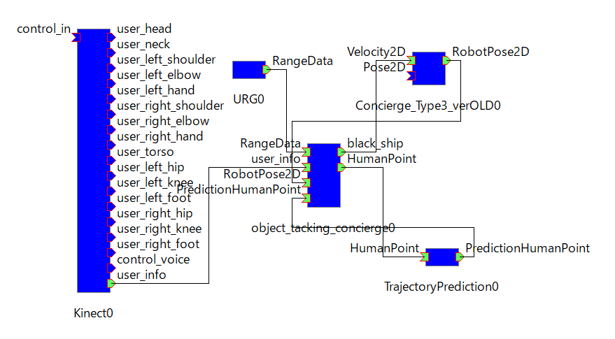
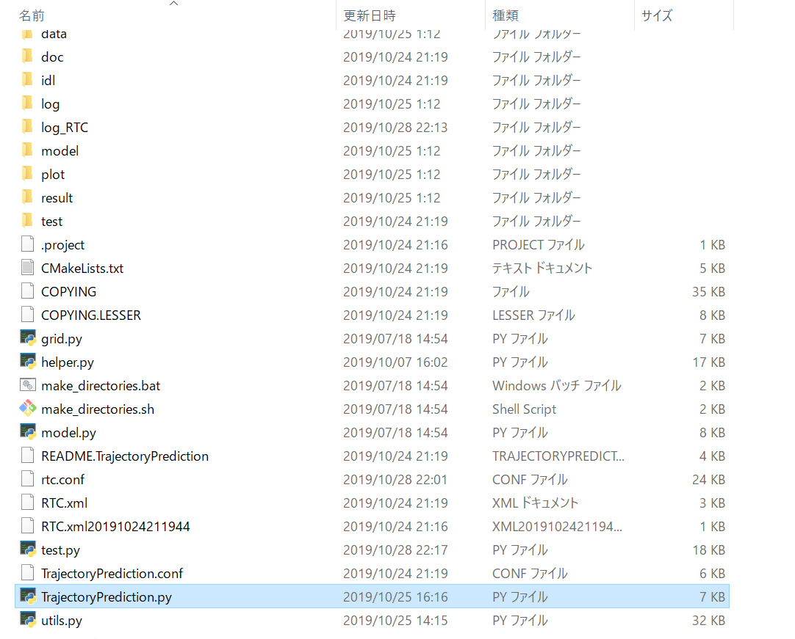
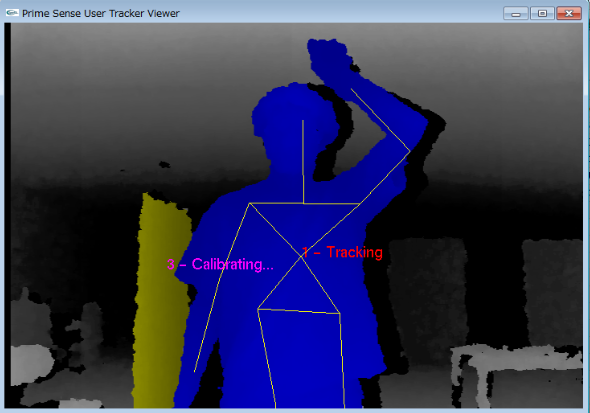

<h3>RTミドルウェアコンテスト</h3>
<h1>「追従中の人の軌跡を予測するRTC」ユーザーマニュアル</h1>

芝浦工業大学 機械機能工学科 知能機械システム研究室 加藤 宏一朗
東京女子大学 数理科学科 加藤研究室 赤羽根 里奈

**目次**
- [1. 追従中の人の軌跡を予測するRTC概要](#1-%e8%bf%bd%e5%be%93%e4%b8%ad%e3%81%ae%e4%ba%ba%e3%81%ae%e8%bb%8c%e8%b7%a1%e3%82%92%e4%ba%88%e6%b8%ac%e3%81%99%e3%82%8brtc%e6%a6%82%e8%a6%81)
  - [1.1 はじめに](#11-%e3%81%af%e3%81%98%e3%82%81%e3%81%ab)
  - [1.2 開発・動作環境](#12-%e9%96%8b%e7%99%ba%e3%83%bb%e5%8b%95%e4%bd%9c%e7%92%b0%e5%a2%83)
  - [1.3 使用機器](#13-%e4%bd%bf%e7%94%a8%e6%a9%9f%e5%99%a8)
    - [1.3.1 移動台車](#131-%e7%a7%bb%e5%8b%95%e5%8f%b0%e8%bb%8a)
    - [1.3.2 測域センサ](#132-%e6%b8%ac%e5%9f%9f%e3%82%bb%e3%83%b3%e3%82%b5)
    - [1.3.3 Depthセンサ](#133-depth%e3%82%bb%e3%83%b3%e3%82%b5)
- [2. 本システムの各RTCの概要と仕様](#2-%e6%9c%ac%e3%82%b7%e3%82%b9%e3%83%86%e3%83%a0%e3%81%ae%e5%90%84rtc%e3%81%ae%e6%a6%82%e8%a6%81%e3%81%a8%e4%bb%95%e6%a7%98)
  - [2.1 各RTCの仕様](#21-%e5%90%84rtc%e3%81%ae%e4%bb%95%e6%a7%98)
- [3. 軌跡予測RTC(TrajectoryPrediction RTC)](#3-%e8%bb%8c%e8%b7%a1%e4%ba%88%e6%b8%acrtctrajectoryprediction-rtc)
  - [3.2 予測結果](#32-%e4%ba%88%e6%b8%ac%e7%b5%90%e6%9e%9c)
- [4. 本システムの使用方法](#4-%e6%9c%ac%e3%82%b7%e3%82%b9%e3%83%86%e3%83%a0%e3%81%ae%e4%bd%bf%e7%94%a8%e6%96%b9%e6%b3%95)
  - [4.1 ハードウェアの準備](#41-%e3%83%8f%e3%83%bc%e3%83%89%e3%82%a6%e3%82%a7%e3%82%a2%e3%81%ae%e6%ba%96%e5%82%99)
  - [4.2 動作環境](#42-%e5%8b%95%e4%bd%9c%e7%92%b0%e5%a2%83)
  - [4.3 RTCのダウンロード](#43-rtc%e3%81%ae%e3%83%80%e3%82%a6%e3%83%b3%e3%83%ad%e3%83%bc%e3%83%89)
  - [4.4 システムの起動](#44-%e3%82%b7%e3%82%b9%e3%83%86%e3%83%a0%e3%81%ae%e8%b5%b7%e5%8b%95)
  - [4.5 RTCの接続](#45-rtc%e3%81%ae%e6%8e%a5%e7%b6%9a)
    - [4.5.1 PC間の接続](#451-pc%e9%96%93%e3%81%ae%e6%8e%a5%e7%b6%9a)
    - [4.5.2 各RTCの接続](#452-%e5%90%84rtc%e3%81%ae%e6%8e%a5%e7%b6%9a)
  - [4.6 システムの起動](#46-%e3%82%b7%e3%82%b9%e3%83%86%e3%83%a0%e3%81%ae%e8%b5%b7%e5%8b%95)
    - [4.7 追従の開始](#47-%e8%bf%bd%e5%be%93%e3%81%ae%e9%96%8b%e5%a7%8b)
- [5. 参考文献](#5-%e5%8f%82%e8%80%83%e6%96%87%e7%8c%ae)


<div style="page-break-before:always"></div>


# 1. 追従中の人の軌跡を予測するRTC概要 
## 1.1 はじめに 
　近年，サービスロボットの市場が急激に拡大すると予測されている．人と共存するサービスロボットは，高齢者の介護や商業施設での道案内，外国人との対話など，直接人と関わる場合が多く，これらの場合では，できるだけ人の近くにロボットがいることが好ましい．そのためにロボットには人物追従の機能は必要不可欠である．人とロボットがやりとりを行う際にロボットは人の動きを見て動く必要があり，ロボットが決まった経路を移動するよりも，ロボットが自由に動く方が適しているからである．本研究室では，RTミドルウェアを用いて追従ロボットの研究が行われてきた．追従ロボットに必要不可欠な機能として，特定の人物（ターゲット）を追従すること，ターゲットを見失った際に正確に人物を再検出するロバスト性を持つこと，そのターゲットを再追従することが挙げられる．そこで，追従精度の向上を目的に予め機械学習で学習した予測器を用いて，追従中にリアルタイムでターゲットの軌跡を予測するRTCを開発した．

## 1.2 開発・動作環境  
- PC ①
  - OS : Windows7 Enterprise 64bit
  - プロセッサ : Intel® Core™i5-3320M CPU@2.6GHz
  - 実装メモリ : 4.00GB
  - OpenRTM-aist1.2.0 32bit
  - CMake 3.5.2
  - OpenNI 2
- PC ②
  - OS : Windows 10 Home 64bit
  - プロセッサ : Intel® Core™i5-8250U CPU@1.6GHz
  - 実装メモリ : 8.00GB
  - OpenRTM-aist1.2.0 64bit
  - Python 3.7.2 64bit

## 1.3 使用機器  
### 1.3.1 移動台車  
本システムでは図1に示す移動ロボットを用いる．移動台車はVECTOR株式会社のコンシェルジュ，頭部にDepthセンサ，腹部には測域センサが搭載されている． 
<div align="left"> 

</div>

<div style="text-align: left;">
図1-1 移動台車
</div>

### 1.3.2 測域センサ  
測域センサは北陽電機株式会社のURG-04LX-UG01[1]を用いた．図1-2に外観，表1-1に主な仕様を示す．  

<div align="left">

</div>  

<div style="text-align: left;">
図1-2 測域センサ
</div>
<br>
表 1-1 URG-04LX-UG01の主な仕様


|項目|仕様|
|:---:|:---|
|光源|半導体レーザ：λ=785 [nm] ( FDAレーザ安全クラス1 )|
|測距範囲|距離：0.02-5.6[m] <br> 角度：240[°]|
|測距精度|0.06-1[m]：±30[mm], 1-4[m]：距離の3[%]|
|測距分解能|約1[mm]|
|角度分解能|ステップ角：約0.36[°]|
|走査時間|100[ms/scan]|


### 1.3.3 Depthセンサ  
DepthセンサはASUS社の Xtion Pro LIVEⓇ[2]を用いた．OpenNIを用いて人の骨格情報を取得する．図1-3に外観，表1-2に主な仕様を示す．  

<div align="left">
  
</div>

<div style="text-align: left;">
図1-3 Depthセンサ
</div>

<br>
表 1-2 Xtion PRO LIVE の主な使用

|項目|仕様|
|:---:|:---|
|センサー|RGBセンサ，深度センサ，ステレオマイク|
|深度センサ解像度|640×480ドット (VGA) /30fps <br> 320×240ドット (QVGA) /60fps|
|センサ有効範囲|水平58[°]，垂直45[°]，対角70[°]|
|センサ有効距離|0.8m-3.5m|


<div style="page-break-before:always"></div>


# 2. 本システムの各RTCの概要と仕様  
本システムは，"Kinect RTC"，"URG RTC"，"Concierge_Type3_verOLD"，"object_tracking_concierge RTC"，"TrajectoryPrediction RTC"で構成されている．図2-1に本システムのRTC図，表2-1に概要を示す．

<div align="left">
 
</div>

<div style="text-align: left;">
図2-1 RTC図
</div>
<br>

<div style="text-align: left;">
表2-1 各RTC概要
</div>


| RTC名                       | 説明 |
|:---:                        |:---:|
|  Kinect                     | xtionから人の座標を取得するRTC |
|  URG                        | 測域センサから値を取得するRTC |
|  Concierge_Type3_verOLD     | 移動台車を動かすRTC |
|  object_tracking_concierge  | センサからの値を受け取り指令を出すRTC |
|  TrajectoryPrediction                 | 今回開発した人の軌跡を予測するRTC |


## 2.1 各RTCの仕様  
 - Kinect RTC  
本RTCは先述したXtion Pro LiveのセンサデータからOpenNIを使用して人の座標を取得し，出力するRTCである．図2-2にRTCを示す．人の部位名のアウトポートから人の座標(x, y, z)を出力する．また，人のid，右手，右ひじ，右肩の情報を文字列にしたデータを user_info から出力している．今回はこのOutportを用いる．  

<div align="left">
 
</div>

<div style="text-align: left;">
図2-2 Kinect RTC
</div>
<br>

 - URG RTC  
本RTCは，先述したURG-04LXのセンサデータを取得し，出力するRTCである．ロボット周囲の障害物と人の検知に使用する．Xtionの方で何かのエラーで人を見失った際にはURGからの人のデータで追従を行う．  

<div align="left">
 
</div>

<div style="text-align: left;">
図2-3 URG RTC
</div>
<br>

 - Concierge_Type3_verOLD RTC  
本RTCは，object_tracking_concoergeから速度指令を受け取り，移動台車を動かすRTCである．また，Outportからオドメトリ[m]を出力する．  

<div align="left">
 
</div>

<div style="text-align: left;">
図2-4 Concierge_Type3_verOLD RTC
</div>
<br>

 - object_tracking_concierge RTC  
本RTCは，kinect RTC から人の位置情報[mm]，URG RTC からRangeデータを受け取り，それらのデータを統合し，人との距離が一定になるように移動台車に速度指令を送る．また，移動台車からオドメトリ[m]を受け取り，ワールド座標系の人の座標[m]を計算し，軌跡予測RTCにその座標を出力する．  

<div align="left">
 
</div>

<div style="text-align: left;">
図2-5 object_tracking_concierge RTC
</div>
<br>

 - TrajectoryPrediction RTC  
本RTCは今回開発した人の移動軌跡を予測するRTCである． object_tracking_concierge RTCからワールド座標系の人の位置座標を受け取り，それをもとに軌跡の予測をする．詳細は次章にて解説する．  

<div align="left">
 
</div>

<div style="text-align: left;">
図2-6 TrajectoryPrediction RTC
</div>
<br>

<div style="page-break-before:always"></div>

# 3. 軌跡予測RTC(TrajectoryPrediction RTC)  
本RTCは今回新規に開発したRTCである．東京女子大学の加藤研究室[3]がSocial-LSTM[4]を用いて予測器を構築した．機械学習した予測器で追従対象者の軌跡を予測して出力する．InportのHumanPointは人の座標を受け取るポートであり，object_tracking_conciergeから追従中の追従対象者の位置座標を受け取る．OutportのPredictionHumanPointは予測した人の座標を出力する．図3-1と表3-1に外観と詳細を示す．今回は学習に用いたデータセットがETH Dataset[5]のため，ワールド座標系の人の座標をもとに予測をする．  

現在の仕様は.txtファイル経由でデータの受け取り，出力を行っている．まずRTCが人の位置座標を受け取り，`TrajectoryPrediction/data/test/crowds/input.txt`に人のデータを書き込む．そのファイルから最新の10フレーム分を用いて予測器にて予測を行い `TrajectoryPrediction/result/SOCIALLSTM/LSTM/test/crowds/output.txt`に予測した10フレーム分のデータを出力する．    

<div align="left">
 
</div>

<div style="text-align: left;">
図3-1 TrajectoryPrediction RTC
</div>
<br>
<br>

表 3-1 TrajectoryPrediction RTCポート  
</div>

|In/Out| Port名 | データ型 | 機能 | データの例 |
|:---: |:---: |:---:    |:---:|  :---:|
|In    |HumanPoint|TimedDoubleSeq|人の座標を受け取る|HumanPoint.data.[0] = 人のx座標  HumanPoint.data.[1] = 人のy座標|
|Out    |PredictionHumanPoint|TimedDoubleSeq|予測した人の座標を出力する|PredictionHumanPoint.data.[2n-1] = 人のx座標 <br> PredictionHumanPoint.data.[2n] = 人のy座標 <br> (1≦n≦5)|  


## 3.2 予測結果  
今回の予測器を用いて簡単な実験を行ったところ以下のようになった．10フレーム分の人の座標データからその先10フレーム分を予測する．実際に予測をロボットに適応する際は5フレーム分を受け取り，その座標をロボットに追従させる．安全面を考慮して，予測結果が人を見失った座標から大きく離れていた場合はその予測を適応しない．  

```
***ここにグラフか何かをいれる***
```


<div style="page-break-before:always"></div>

# 4. 本システムの使用方法
## 4.1 ハードウェアの準備
本マニュアルでは，本研究室で使用しているロボットの既存の環境を流用するために，開発したRTCの動作環境と異なる環境のPCを使用した．そのためにPCを2台使用している．  
移動ロボット，センサーに接続するPCと開発したRTCを動かすPCとなっている．前者をPC①，後者をPC②とする．  
PC①にURG，Xtion，移動台車を接続する．  

## 4.2 動作環境
以下に本稿で使用するシステムの動作環境を示す．
 - PC①
   - OS : Windows 7
   - OpenRTM 1.2.0
   - **OpenNI 2**
 - PC②
   - OS : Windows 10
   - **OpenRTM 1.2.0 64bit版**
   - **Python3 64bit版が使用**

また，PC②のTrjectoryPrediction RTCを動作させるにはpip等で以下のモジュールをインストールする必要がある．ただし留意点として，pytorchはwindows上のPython2系およびPython 32bit版には対応していない．  
- numpy  
- pandas  
- pytorch 1.3.0+cpu  


## 4.3 RTCのダウンロード
GithubからPC①にobject_tracking_concierge，PC②にTrajectoryPredictionをダウンロードする．  
object_tracking_concierge RTCはC++言語で実装されているため，ビルドを行う必要がある．


## 4.4 システムの起動
- PC①，PC②共通  
Start Naming Service とeclipseを起動する．ワークスペースの選択ではRTCのフォルダがあるワークスペースを選択する．また，2台のPCが同ネットワークに接続されている必要がある．  


 - PC①  
PC①で動作させるRTCはC++で実装されているため，exeファイルから起動させる．  

| RTC名                       | 起動ファイル |
|:---:                        |:---:|
|  Kinect                     | KinectComp.exe|
|  URG                        | URGComp.exe |
|  Concierge_Type3_verOLD     | Concierge_Type3_verOLDComp.exe |
|  object_tracking_concierge  | object_tracking_conciergeComp.exe |
<br>

 - PC②  
TrajectoryPrediction RTCはPython言語で書かれているため，コマンドプロンプトからPythonファイルのあるディレクトリに移動して以下のように実行するか，図4-1のようにファイルを選択して実行する．<br>  
    `Python TrajectoryPrediction.py`  
<br>

<div align="left">
 
</div>

<div style="text-align: left;">
図4-1 TrajectoryPrediction.py
</div>
<br>


## 4.5 RTCの接続
### 4.5.1 PC間の接続
PC①またはPC②のEclipseでネームサーバーの追加からもう一方のPCのIPアドレスを入力して接続する．

### 4.5.2 各RTCの接続
4.5.1でネームサーバーを追加したPCで，4.4で起動したRTCをSystem Diagram上にドラッグ&ドロップし，各RTCのポートを図2-1のように接続する．  


## 4.6 システムの起動  
各コンポーネントをアクティベートする．PC①上でPrime Sense USer Tracker ViewerとURG_Dataのウィンドウが起動するのでの表示を図4-1のように表示させる．URG_Dataのウィンドウはobject_tracking_concierge RTC内でウィンドウプロシージャを使用して表示させているのでこのウィンドウが前面にない場合，動作しない．  

<div align="left">
 
</div>

<div style="text-align: left;">
図4-2 表示画面
</div>
<br>

### 4.7 追従の開始
右手より右ひじが上かつ，右ひじより右肩が上のポーズ(図4-2)を認識したタイミングで追従を開始する．追従を終わらせたい場合は再度右手を上げる．今回開発した TrajectoryPrediction RTCは曲がり角，障害物の回避後などで人を見失った場合(Xtion，URGからの人の座標が更新されなくなった場合)に動作する． 

<div align="left">
 
</div>

<div style="text-align: left;">
図4-3 追従開始/終了のポーズ
</div>
<br> 

<div style="page-break-before:always"></div>

# 5. 参考文献

 [1] : [URG](https://www.hokuyo-aut.co.jp/search/single.php?serial=17)  

 [2] : [Xtion](https://www.asus.com/jp/3D-Sensor/Xtion_PRO_LIVE/)  

 [3] : [東京女子大学 加藤研究室](https://scrapbox.io/katolab/)  

 [4] : [Social-LSTM](http://openaccess.thecvf.com/content_cvpr_2016/html/Alahi_Social_LSTM_Human_CVPR_2016_paper.html)  

 [5] : Pellegrini, S., Ess, A., Schindler, K. and van Gool, L.:You'll
Never Walk Alone: Modeling Social Behavior for Multi-target
Tracking, Proc. IEEE International Conference on Computer
Vision (ICCV 2009), pp. 261-268(2009).  

<div style="page-break-before:always"></div>

***
連絡先：
芝浦工業大学 機械機能工学科 知能機械システム研究室  
〒135-8548 東京都江東区豊洲3-7-5  
加藤　宏一朗 Koichiro Kato  
E-mail : ab16035@shibaura-it.ac.jp  

東京女子大学 数理科学科 加藤研究室
〒167-8585 東京都杉並区善福寺2-6-1
赤羽根 里奈 Rina Akabane
E-mail : d19m201@cis.twcu.ac.jp